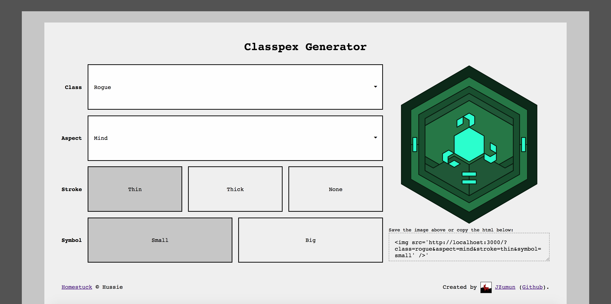

# Homestuck Classpex Generator

Rewrite of the old [classpex generator](https://jzumun.tumblr.com/classpex) I made on tumblr five years ago, this time using pug and express to dynamically render the SVG on the server.

## Background
"Classpex" is short for "Class-Aspect hexagon", and is inspired by Hero Titles in Homestuck lore.

[Homestuck](http://homestuck.com/) is a web-comic written by Andrew Hussie, about four kids who play a game that destroys the world. In Homestuck, the main characters are given Hero Titles, which are a combination of an aspect (e.g. breath, light, time, and space), and a class (e.g knight, witch, seer, and heir). Classpexes are meant to represent these various combinations.

## Examples
### Heir of Breath

### Seer of Light

### Knight of Time

### Witch of Space

